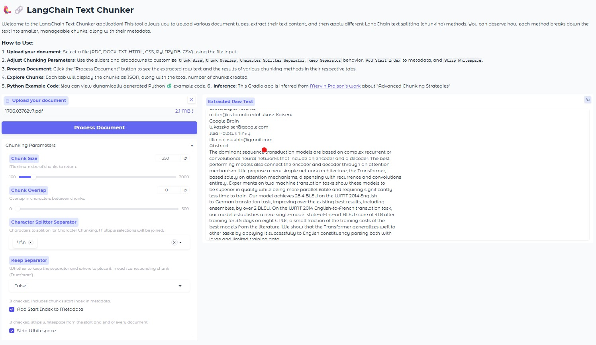
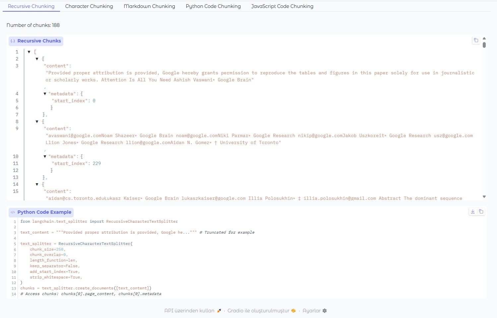

# 🦜️🔗 LangChain Text Chunker

[](https://www.python.org/)
[](https://gradio.app/)
[](https://opensource.org/licenses/MIT)

## Description

Welcome to the 🦜️🔗 LangChain Text Chunker application! This interactive tool, built with Gradio, empowers users to effortlessly upload various document types, extract their raw text content, and then apply a diverse set of LangChain text splitting (chunking) methods. It provides a clear visualization of how each method breaks down text into smaller, manageable chunks, complete with their associated metadata. Furthermore, for developers and researchers, the application dynamically generates Python code examples, allowing for easy replication and integration of the chunking strategies.

## Features

*   **Multi-Document Type Support**: Seamlessly process text from a wide range of document formats, including:
    *   PDF (`.pdf`)
    *   Microsoft Word (`.docx`)
    *   Plain Text (`.txt`)
    *   HTML (`.html`)
    *   CSS (`.css`)
    *   Python Code (`.py`)
    *   Jupyter Notebooks (`.ipynb`)
    *   CSV (`.csv`)
*   **Diverse Chunking Strategies**: Explore and compare the output of various LangChain text splitters:
    *   **Recursive Character Text Splitter**: Ideal for general-purpose text, attempting to split on a list of characters in order.
    *   **Character Text Splitter**: Splits text based on a single, user-defined separator.
    *   **Markdown Text Splitter**: Specifically designed to understand and preserve the structure of Markdown documents.
    *   **Python Code Text Splitter**: Optimized for splitting Python source code while maintaining syntactical integrity.
    *   **JavaScript Code Text Splitter**: Utilizes language-specific rules to chunk JavaScript code effectively.
*   **Customizable Chunking Parameters**: Fine-tune the chunking process with adjustable parameters:
    *   `Chunk Size`: Define the maximum size of the generated chunks.
    *   `Chunk Overlap`: Specify the number of characters that overlap between consecutive chunks.
    *   `Character Splitter Separator`: Choose custom separators for the Character Chunking method.
    *   `Keep Separator`: Control whether the separator is included in the chunk and its placement.
    *   `Add Start Index to Metadata`: Option to include the starting character index of each chunk in its metadata.
    *   `Strip Whitespace`: Automatically remove leading/trailing whitespace from chunks.
*   **Interactive Chunk Visualization**: View the resulting chunks in a clear, structured JSON format within the Gradio interface.
*   **Dynamic Python Code Examples**: For each chunking method, the application generates ready-to-use Python code, demonstrating how to achieve the same chunking results programmatically. This is invaluable for integrating these strategies into your own projects.
*   **User-Friendly Gradio Interface**: An intuitive web interface that makes it easy for anyone to experiment with text chunking without deep programming knowledge.

## Installation

To get this application up and running on your local machine, follow these steps:

### Prerequisites

*   Python 3.8 or higher

### Steps

1.  **Clone the repository:**
    ```bash
    git clone https://github.com/tolgakurtuluss/langchain-text-chunker.git
    cd langchain-text-chunker
    ```

2.  **Create a virtual environment (recommended):**
    ```bash
    python -m venv venv
    ```

3.  **Activate the virtual environment:**
    *   **On Windows:**
        ```bash
        .\venv\Scripts\activate
        ```
    *   **On macOS/Linux:**
        ```bash
        source venv/bin/activate
        ```

4.  **Install dependencies:**
    ```bash
    pip install -r requirements.txt
    ```

## Usage

Once the installation is complete, you can run the Gradio application:

1.  **Run the application:**
    ```bash
    python app.py
    ```
    This command will start the Gradio server, and you will typically see a local URL (e.g., `http://127.0.0.1:7860`) in your terminal. Open this URL in your web browser.

2.  **Using the Interface:**
    *   **Upload your document**: Use the "Upload your document" file input to select a file (PDF, DOCX, TXT, HTML, CSS, PY, IPYNB, CSV).
    *   **Adjust Chunking Parameters**: Utilize the sliders, dropdowns, and checkboxes in the "Chunking Parameters" accordion to customize `Chunk Size`, `Chunk Overlap`, `Character Splitter Separator`, `Keep Separator` behavior, `Add Start Index` to metadata, and `Strip Whitespace`.
    *   **Process Document**: Click the "Process Document" button. The extracted raw text will appear, and the results of various chunking methods will be displayed in their respective tabs.
    *   **Explore Chunks**: Navigate through the tabs ("Recursive Chunking", "Character Chunking", etc.) to see the chunks as JSON, along with the total number of chunks created for each method.
    *   **Python Example Code**: In each chunking tab, you can view dynamically generated Python code that demonstrates how to achieve the same chunking results programmatically.

### Inspiration

This Gradio application is inspired by and inferred from [Mervin Praison's insightful work](https://mer.vin/2024/03/chunking-strategy/) on "Advanced Chunking Strategies."

## Screenshots

*Interface for interacting with "Attention is All You Need 1706.03762" paper.*


*Chunking results of Recursice Chunking Method.*



## Contributing

Contributions are welcome! If you have suggestions for improvements or new features, please follow these steps:

1.  Fork the repository.
2.  Create a new branch (`git checkout -b feature/YourFeature`).
3.  Make your changes.
4.  Commit your changes (`git commit -m 'Add some feature'`).
5.  Push to the branch (`git push origin feature/YourFeature`).
6.  Open a Pull Request.

## License

This project is licensed under the MIT License - see the [LICENSE](LICENSE) file for details.
